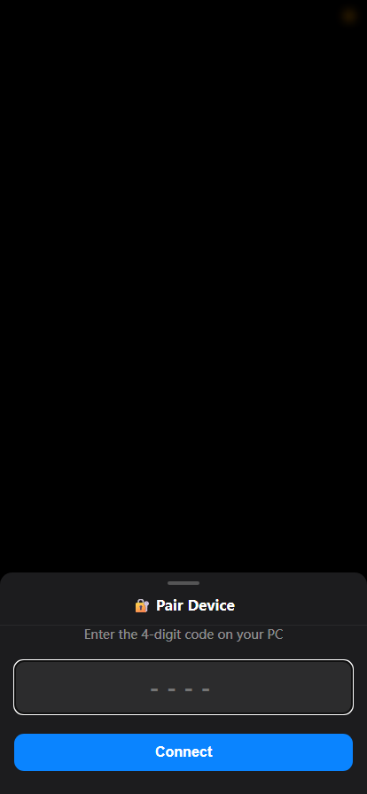

# 📱 CortexPad

将安卓手机变成 Windows 电脑的自定义快捷键面板（类似 Stream Deck）。通过 WiFi 连接，手机变成你的专属遥控器——一键静音、调节音量亮度、启动程序、执行快捷键组合，全部可视化编辑。



---

## ✅ 功能特性

- 📱 **手机遥控电脑** — WiFi 连接，实时双向通信
- 🏎️ **可视化按钮编辑** — 拖拽布局，emoji 图标选择器
- ⌨️ **快捷键录制** — 按键组合自动识别填入
- 🎯 **8 种动作类型** — 快捷键、文本输入、打开程序、系统操作、延时、脚本、媒体控制、窗口管理
- 🎵 **媒体控制面板** — 播放/暂停、上一首、下一首
- 🪟 **窗口管理** — 最大化、最小化、左右分屏
- 📋 **剪贴板同步** — 手机端查看/编辑电脑剪贴板（可选）
- 📳 **手机振动反馈** — 按钮触发时触觉反馈
- 📊 **系统状态监控** — CPU / 内存 / 磁盘 / GPU / 音量 / 亮度实时显示
- 📌 **长按动作** — 短按和长按触发不同操作
- 🛡️ **配对码安全机制** — 首次连接需输入 4 位配对码
- 🔁 **断线自动重连** — 网络中断后自动恢复
- 🖥️ **系统托盘运行** — 关闭窗口后服务继续在后台运行
- 📦 **一键打包 EXE** — 无需 Python 环境即可分发

---

## 🚀 快速开始

### 开发环境运行

```bash
# 1. 克隆项目
git clone https://github.com/yourname/CortexPad.git
cd CortexPad

# 2. 安装依赖
pip install -r requirements.txt

# 3. 运行（建议以管理员身份运行以获得完整功能）
python main.py
```

### 使用 start.bat (Windows 用户推荐)

```bash
# 双击运行 start.bat
# 或右键选择 "以管理员身份运行"
start.bat
```

### 使用方法

1. 电脑运行后，系统托盘出现蓝色图标
2. 浏览器自动打开，显示二维码和配对码
3. 手机扫描二维码（或手动输入地址）
4. 输入 4 位配对码完成配对
5. 点击按钮即可控制电脑

---

## 📦 打包为 EXE

```bash
pip install pyinstaller
python -m PyInstaller CortexPad.spec --noconfirm --clean
```

生成的 `dist/CortexPad.exe` 可直接分发给其他人使用，无需安装 Python。

---

## ⚙️ 配置说明

编辑 `config.json` 自定义按钮布局，或直接在手机端编辑：

### 动作类型

| 类型 | 说明 | 示例 |
|------|------|------|
| `hotkey` | 键盘快捷键 | `{"type":"hotkey","value":"ctrl+c"}` |
| `text` | 输入文本 | `{"type":"text","value":"hello world"}` |
| `open` | 打开程序/链接 | `{"type":"open","value":"https://google.com"}` |
| `system` | 系统操作 | `{"type":"system","value":"mute"}` |
| `delay` | 延时（毫秒） | `{"type":"delay","value":1000}` |
| `script` | 执行脚本 | `{"type":"script","value":"notepad.exe"}` |
| `media` | 媒体控制 | `{"type":"media","value":"play_pause"}` |
| `window` | 窗口管理 | `{"type":"window","value":"maximize"}` |

### 按钮模式

| 模式 | 说明 |
|------|------|
| `normal` | 短按触发动作 |
| `toggle` | 短按切换开/关状态 |
| `long_press` | 短按和长按触发不同操作 |

### 系统操作列表

| 操作 | 说明 |
|------|------|
| `mute` | 静音/取消静音 |
| `volume_up` | 增大音量 |
| `volume_down` | 减小音量 |
| `brightness_up` | 增大亮度 |
| `brightness_down` | 减小亮度 |
| `lock` | 锁屏 |
| `shutdown` | 关机 |

### 媒体控制列表

| 操作 | 说明 |
|------|------|
| `play_pause` | 播放/暂停 |
| `next` | 下一首 |
| `previous` | 上一首 |
| `volume_up` | 增大音量 |
| `volume_down` | 减小音量 |
| `mute` | 静音切换 |

### 窗口管理列表

| 操作 | 说明 |
|------|------|
| `maximize` | 最大化窗口 |
| `minimize` | 最小化窗口 |
| `tile_left` | 窗口左分屏 |
| `tile_right` | 窗口右分屏 |
| `switch` | 窗口切换（Alt+Tab） |
| `close` | 关闭窗口（Alt+F4） |

---

## 📁 项目结构

```
CortexPad/
├── main.py              # 程序入口 + 系统托盘
├── server.py            # FastAPI + WebSocket 服务
├── action_executor.py   # 动作执行（快捷键/延时/脚本/媒体/窗口）
├── state_monitor.py     # 系统状态监控（CPU/内存/磁盘/剪贴板）
├── config_manager.py    # 配置管理（读写 config.json）
├── voice_recognizer.py  # 语音识别模块（Whisper）
├── static/
│   └── index.html       # 前端 UI（纯 HTML + CSS + JS）
├── config.json          # 按钮配置文件（不提交到 git）
├── configs/             # 配置文件目录
├── CortexPad.spec       # PyInstaller 打包配置
├── build.bat            # 一键打包脚本
├── start.bat            # 一键启动脚本
├── requirements.txt     # Python 依赖
├── icon.png             # 自定义托盘图标（可选）
├── .gitignore           # Git 忽略文件
└── README.md            # 项目说明
```

---

## 🔧 技术栈

| 类别 | 技术 |
|------|------|
| **后端** | Python, FastAPI, WebSocket, Uvicorn |
| **前端** | 原生 HTML / CSS / JavaScript（无框架依赖） |
| **系统集成** | PyAutoGUI, PyCaw, Screen Brightness Control, psutil, pyperclip |
| **桌面托盘** | pystray, Pillow |
| **语音识别** | faster-whisper（Whisper small 模型，支持 GPU 加速） |
| **打包** | PyInstaller |

---

## ⚠️ 注意事项

- 需要管理员权限（键盘模拟和音量控制需要）
- 手机和电脑需在同一局域网
- 首次连接需要输入配对码
- Text 动作会临时使用剪贴板
- 配对码每 5 分钟自动更换
- `config.json` 包含个人配置，不会提交到 git

---

## 🛠️ 故障排除

**无法连接？**
- 检查防火墙是否放行 8765 端口
- 确认手机和电脑在同一网络

**快捷键不生效？**
- 确保以管理员身份运行
- 检查目标应用是否在前台

**音量/亮度控制失败？**
- 确保已安装 `pycaw` 和 `screen_brightness_control`
- 某些笔记本可能需要额外驱动

**CMD 显示问号？**
- 已在 `start.bat` 中自动设置 UTF-8 代码页
- 如果仍有问题，尝试用新的 PowerShell 终端运行

---

## 📄 License

MIT
